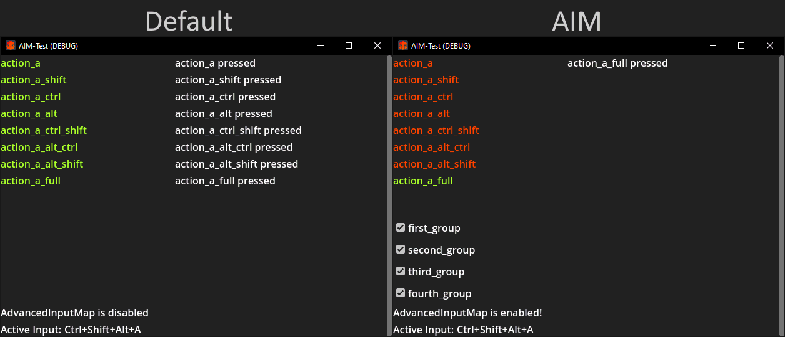

# Advanced Input Map (AIM)

This addon aims to enhance the input map by adding input-groups and cascaded resolution of input.

## Thoughts behind

When mapping keys in the regular input map, all matching bindings will be executed. This results in actions being 
triggered that should not be triggered.

By default, triggering an event with `ctrl+shift+A` will trigger all actions bound to `ctrl+shift+A`, `ctrl+A`, 
`shift+A` and `A`. This is not the behaviour I needed in my projects.

## Features

- replaces `Input Map`-tab in project settings window (now is `Advanced Input Map`)
- group input mappings and enable/disable groups on the fly
- cascading key-binds
  - pressing `A` will trigger actions bound to `A`
  - pressing `shift+A` will trigger actions bound to `shift+A` (ignoring actions listening to `A`)
  - if no actions are found for `shift+A`, AIM will trigger actions bound to `A` instead

## Additional notes

- even though it delivers a new service inside the runtime (`AdvancedInput`) you will still use
`Input.is_action_pressed` etc.
- auto-complete for functions like `is_action_pressed` will still autocomplete for actions defined within the advanced
input map

## Installation

- clone this repository and copy the `addons/advanced_input_map` directory to your project
- go to `Project -> Project Settings... -> Plugins` and enable `Advanced Input Map`
- when the `Input Map`-tab in that window is replaced with the `Advanced Input Map`-tab, you are done

## Usage

### Configuration

The input map works mostly like the regular input map. Now you can assign a group to an action.

This groups can be defined in the `Groups`-tab and predefined as enabled or disabled. The state of the group can be 
adjusted on the fly, while the game/project is running.


### Usage example as in project/testbed



When AIM is enabled, the hotkeys will be parsed on input and automatically trigger the most matching action.

### Group state

To enabled or disable a group you can use `enable_group` and `disable_group`. Using `get_key_groups` and `group_enabled`
can list configured groups and check their status respectively.

An example to use those would be the following script.

```gdscript
# this function is purely to illustrate the usage of AIM group handling.
func toggle_group(group_name: String) -> void:
  if AdvancedInput.get_key_groups().find(group_name) != -1: # check if the group exists
	if AdvancedInput.group_enabled(group_name): # check if the group is enabled
	  AdvancedInput.disable_group(group_name) # disable the group
	else:
	  AdvancedInput.enable_group(group_name) # enable the group
```

You may also call the enable/disable/enabled functions without checking if they exist (without any side effect).

### Input Remapping (User defined key binds)

Not yet implemented...
